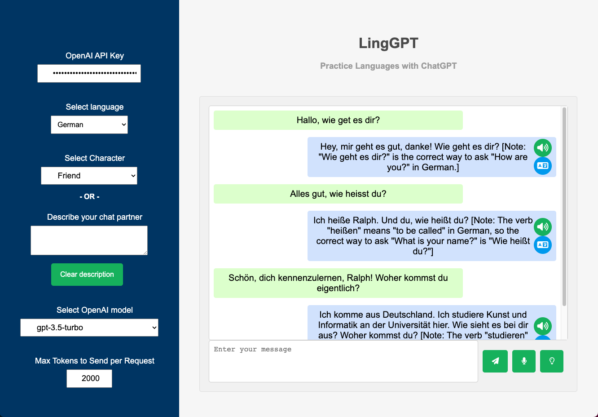

# LingGPT: A Language Learning Practice Buddy
This repository contains the code for LingGPT, a language learning assistant built using OpenAI's GPT-3 and GPT-4 models. The application is developed with Flask and Flask-SocketIO.

# Features
* Real-time chat with the language learning assistant, providing an engaging way to practice a foreign language.
* Write your message by typing or by speaking (using the browser's built-in speech-to-text, works best on Chrome)
* Get grammar corrections and suggestions while chatting
* Hear the responses by clicking ont he Text-to-Speech button (using gTTS package)
* Translate the message to English by clicking on the translate button (using googltrans package)
* Translate a specific word of phrase by selecting or clicking on it, and see the translation pop up
* Don't know what to say next? Get automated suggestions of possible responses to continue the conversation
* Character role-playing to provide a more immersive language learning experience
* Don't like the existing characters? Write a short description for a new one

# Installation
Install using pip:

``
pip install git+https://github.com/guymorlan/LingGPT
``

To run, execute in terminal:

``
linggpt
``

Open browser window at http://localhost:8000, and insert your OpenAI API key.
If you don't have an API key yet, go to OpenAI's website at https://platform.openai.com/account/api-keys.

# Note
This project makes use of OpenAI's GPT-3 and GPT-4 models, which require an API key. Make sure you understand the costs associated with using these models before running this code.
